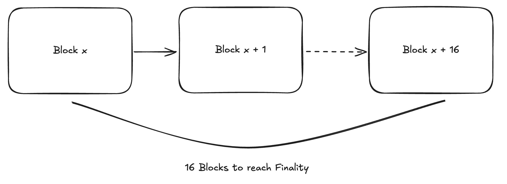

# Tutorial: Understanding and Implementing Milestones with Bor and Heimdall in Polygon PoS

<div align="center">
  <p align="center">
    <a href="http://makeapullrequest.com">
      
    </a>
    <a href="https://twitter.com/BrianSeong99">
      
    </a>
  </p>
</div>

## 1. Introduction to Bor and Heimdall in Polygon PoS

### 1.1 What is Bor?

Bor is the block production layer in the Polygon Proof-of-Stake (PoS) network. It is responsible for:

- Aggregating transactions into blocks.
- Managing the execution of smart contracts.
- Maintaining the state of the Polygon network, such as account balances.

### 1.2 What is Heimdall?

Heimdall acts as the validation & consensus layer. It ensures that the blocks produced by Bor are validated and finalized. It also:

- Manages the network’s consensus using the BFT consensus mechanism.
- Submits checkpoints to the Ethereum mainnet, securing the Polygon chain.

### 1.3 How Do They Work Together?

Bor produces the blocks that make up the Polygon PoS chain, while Heimdall validates these blocks and ensures they are consistent and final. Together, they maintain the integrity and security of the network.

At last, Heimdall is responsible for the finality of the blocks produced by Bor, and submits checkpoints to the Ethereum mainnet.


### 1.4 More on Bor and Heimdall

Check out the official [documentation](https://docs.polygon.technology/pos/architecture/#architectural-overview) for more details on Bor and Heimdall

## 2. The Evolution of Finality: Before and After Milestones

### 2.1 Before Milestones

In the traditional setup:

- Finality was **probabilistic**. Users and developers had to wait for 256 blocks to pass before they could be reasonably sure that a transaction was final. This meant that there was always a small chance of a reorganization (reorg), where a different chain might become the canonical chain.

- Checkpoints to Ethereum: Heimdall would submit checkpoints to Ethereum after every 256 blocks, anchoring Polygon’s state to the security of Ethereum. However, finality on the Polygon chain itself was slow and uncertain until this checkpoint was confirmed.


Finality achieved after 256 blocks (approx. 10 minutes)

### 2.2 After Milestones

With the introduction of milestones:

- Finality is **deterministic**. After a certain number of blocks (e.g., 16), a milestone is proposed and validated by Heimdall. Once 2/3+ of the network agrees, the milestone is finalized, and all transactions up to that milestone are considered final, with no chance of reorganization.

- Separation of Checkpoints and Milestones: Checkpoints still occur every 256 blocks and are submitted to Ethereum. However, milestones provide much faster finality on the Polygon chain itself, improving the user experience significantly.



Finality achieved after 16 blocks (approx. 1-2 minutes)

## 3. Code Examples and Running on a Local Machine

### 3.1 Setting Up Your Local Environment

- Prerequisites:
- Node.js and npm installed.
- Access to a Polygon node (you can use a service like Infura or run your own full node).

### 3.2 Using the Milestone API

Here’s a simple code example to check if a block has reached finality using the milestone mechanism.
```javascript
const axios = require('axios');
const MATIC_RPC_URL = 'https://polygon-mainnet.infura.io/v3/YOUR_INFURA_PROJECT_ID';

async function checkFinality(blockNumber) {
  try {
    const response = await axios.post(MATIC_RPC_URL, {
      jsonrpc: "2.0",
      id: 1,
      method: "eth_getBlockByNumber",
      params: [blockNumber, true]
    });
    
    const latestFinalizedBlock = parseInt(response.data.result.number, 16);
    console.log(`Latest finalized block: ${latestFinalizedBlock}`);
    
    if (latestFinalizedBlock >= blockNumber) {
      console.log("Your transaction block has been finalized.");
    } else {
      console.log("Your transaction block is not yet finalized.");
    }
  } catch (error) {
    console.error("Error checking finality:", error);
  }
}

checkFinality('0x10d4f');  // Replace '0x10d4f' with your block number in hex format
```

### 3.3 Running the Code Locally

- Step 1: Copy the code into a file named checkFinality.js.
- Step 2: Replace YOUR_INFURA_PROJECT_ID with your actual Infura project ID.
- Step 3: Run the code using Node.js:

```javascript
node checkFinality.js
```


- Step 4: Observe the output to determine if your transaction’s block has been finalized.

### 3.4 Experimenting Further

- Modify the code to check different blocks and see how finality is achieved with milestones.
- Test network behavior by simulating a fork or reorg in a private devnet and observe how milestones prevent deep reorgs.

## 4 Resources/References
- [Polygon PoS Documentation](https://docs.polygon.technology/docs/pos/overview)
- [Polygon PoS Faster Finality Announcement](https://polygon.technology/blog/faster-finality-with-the-aalborg-upgrade-for-polygon-proof-of-stake-network)
- [PIP-11: Deterministic finality via Milestones](https://forum.polygon.technology/t/pip-11-deterministic-finality-via-milestones/11918)
- 

# Conclusion

This tutorial has walked you through the basics of Bor and Heimdall in the Polygon PoS network, the evolution from probabilistic to deterministic finality with milestones, and provided you with practical code examples to try on your local machine. With this knowledge, you can better understand how Polygon ensures fast, secure, and reliable transaction finality.